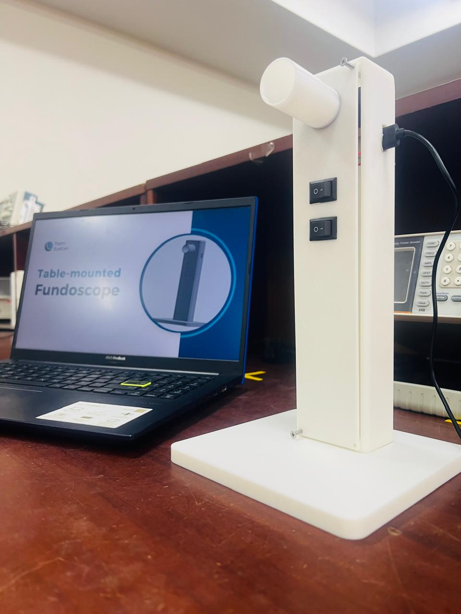

# 👁️ ML-Integrated Fundoscope for Diabetic Retinopathy Detection

This project was developed as part of the **BM2210 – Biomedical Device Design** module (3rd semester) with the goal of advancing **automated eye disease diagnosis** using a smart, **AI-powered table-mounted fundoscope**. By combining **machine learning** and **IoT**, this system enables real-time, accessible, and accurate retinal imaging and classification of diabetic retinopathy severity levels.

---

## 🚀 Project Overview

We designed a **smart table-mounted fundoscope** using an **ESP32-CAM module** paired with a **20D lens** to capture high-resolution fundus images. The images are transmitted wirelessly over Wi-Fi for processing using a custom-trained machine learning model.

---

## 🔍 Key Features

### 🧠 Machine Learning Model
- **Trained on 21,000+ retinal images**
- Built using **TensorFlow** and **Keras**
- Utilizes a **Convolutional Neural Network (CNN)** to classify fundus images into 5 levels of diabetic retinopathy:
  - **Class 0:** Normal Fundus
  - **Class 1:** Mild Disease
  - **Class 2:** Moderate Disease
  - **Class 3:** Severe Disease
  - **Class 4:** Proliferative Disease
- Optimized with **dropout regularization** and careful hyperparameter tuning for strong accuracy.

### 🌐 IoT Integration
- Images captured using the **ESP32-CAM** are transmitted over **Wi-Fi** for real-time diagnosis.
- Supports **remote access**, making it ideal for **telemedicine applications** and use in **resource-limited settings**.

### 💻 Streamlit UI
- Interactive **Streamlit dashboard** allows clinicians to:
  - Upload fundus images
  - Get real-time classification results
  - View **confidence levels** for each prediction
  - Access **reference information** for each disease level

---

## 🌟 Vision and Impact

This project addresses the increasing need for **early detection of diabetic retinopathy**, especially in regions with limited access to ophthalmologists. By integrating **AI** and **IoT** technologies, our device empowers healthcare providers with **faster, data-driven decisions**, improving patient outcomes and preventing vision loss.

---

## 🧪 Tech Stack

- **Hardware:** ESP32-CAM, 20D lens
- **Software:** Python, TensorFlow, Keras, Streamlit
- **Communication:** Wi-Fi (ESP32 to PC)
- **Dataset:** A publicly available retinal fundus image dataset (21,000+ samples)

---

## 📌 Future Enhancements

- Add support for mobile diagnostics
- Integrate data logging for patient monitoring over time
- Improve image preprocessing and segmentation for higher model accuracy

